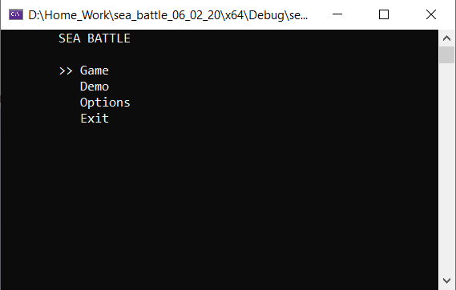
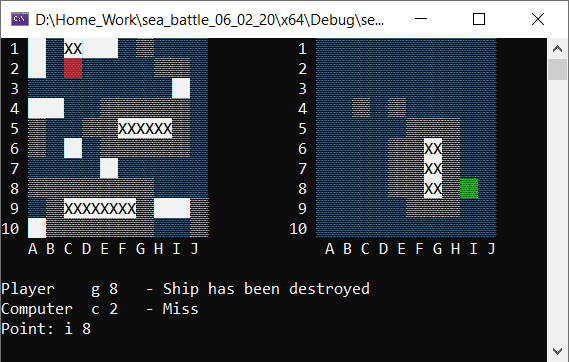

# Sea Battle (Battleships) / Морской бой

### *Итоговая работа по курсу "Основы программирования на языке С++"*

«Морской бой» — игра для двух участников, в которой игроки по очереди называют координаты на неизвестной им карте соперника. Если у соперника по этим координатам имеется корабль (координаты заняты), то корабль или его часть «топится», а попавший получает право сделать ещё один ход. Цель игрока — первым потопить все корабли противника.

#### *В данной программе реализовано следующее:*
1) Режим игры "Игрок против ИИ (Искуственного Интелекта)"
2) Демонстрационный режим (ИИ против  ИИ)
3) Расстановка кораблей в режиме "Игрок против ИИ"
4) Карты различных размеров (5х5, 10х10, 15х15)
5) Режим игры с альтернативным набором кораблей (Options -> Game mode)
6) Возможность отключить расстановку кораблей в режиме "Игрок против ИИ" (Options -> Generator)
7) Изменение цветовой темы игры (Options -> Themes)
8) Выход из игры в главное меню (ESC)

***Запуск:***
**sea_battle.sln** (Microsoft Visual Studio Community 2019 (Версия 16.4.3))

#
 ***Студент:***	      	*Кутырёв Д.О.*
 
 ***Преподаватель:***		*Швечиков А. А.*

***Компьютерная Академия "ШАГ", Москва, Февраль 2020***

#
#

### *Exam project for the course "C++ Programming Basics"*

Battleship (also Battleships or Sea Battle) is a strategy type guessing game for two players. It is played on ruled grids (paper or board) on which each player's fleet of ships (including battleships) are marked. The locations of the fleets are concealed from the other player. Players alternate turns calling "shots" at the other player's ships, and the objective of the game is to destroy the opposing player's fleet.

#### *In this program, it implements the following:*
1) Game mode "Player vs AI (Artificial Intelligence)"
2) Demonstration mode (AI vs AI)
3) Arrangement of ships in the "Player vs AI" mode
4) Maps of various sizes (5x5, 10x10, 15x15)
5) Game mode with an alternative set of ships (Options -> Game mode)
6) Disable the arrangement of ships in the "Player vs AI" mode (Options -> Generator)
7) Changing the game's color theme (Options -> Themes)
8) Exit the game to the main menu (ESC)

***Launch:***
**sea_battle.sln** (Microsoft Visual Studio Community 2019 (Version 16.4.3))

#
***Student:*** *Kutyrev D. O.*

***Teacher:*** *Shvechikov A. A.*

***Computer Academy "STEP", Moscow, February 2020***
